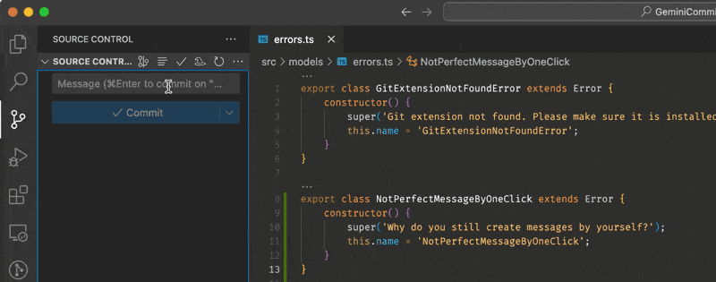

# Commit Sage (formerly GeminiCommit)

    [](https://deepwiki.com/VizzleTF/CommitSage)

Commit Sage is a VSCode extension that automatically generates commit messages using various AI providers:
- Gemini (default, requires API key, free)
- OpenAI (requires API key or compatible provider)
- Codestral (requires API key, free)
- Ollama (local, free)



## Features

- 🤖 AI-powered commit message generation
- 🔄 Auto model selection for Gemini (tries available models until success)
- 🌍 Multiple language support (English, Russian, Chinese, Japanese, Korean, German, French, Spanish, Portuguese)
- 📝 Various commit formats (Conventional, Angular, Karma, Semantic, Emoji, EmojiKarma, Google, Atom)
- 🔄 Smart handling of staged/unstaged changes
- 🚀 Auto-commit and auto-push capabilities
- 🎯 Custom instructions support
- ⚡ Fast and efficient processing

## Configuration

Get your API key:
   - For Gemini: Get it from [Google AI Studio](https://makersuite.google.com/app/apikey)
   - For Codestral: [Mistral AI Console](https://console.mistral.ai/codestral)
   - For custom endpoint: Use your OpenAI API key or other compatible service

### AI Provider Settings

- **Provider Selection** (`commitSage.provider.type`):
  - Choose between: `gemini`, `openai`, `codestral`, `ollama`
  - Default: `gemini`

- **Gemini Settings**:
  - Model (`commitSage.gemini.model`): 
    - Options: `auto`, `gemini-2.0-pro-exp`, `gemini-2.0-flash`, `gemini-2.0-flash-exp`, `gemini-2.0-flash-thinking-exp`, `gemini-2.0-flash-lite`, `gemini-2.5-pro`, `gemini-2.5-flash`, `gemini-2.5-flash-lite`
    - Default: `gemini-2.0-flash`
  - **Auto Mode** (`auto`):
    - Automatically fetches the list of available Gemini models from the API
    - Tries each model sequentially until one succeeds
    - Useful when you don't want to manually update model names or when specific models are unavailable
    - Provides maximum reliability by automatically switching to working models

- **OpenAI Settings**:
  - Model (`commitSage.openai.model`): Default `gpt-3.5-turbo`
  - Base URL (`commitSage.openai.baseUrl`): For custom endpoints/Azure

- **Codestral Settings**:
  - Model (`commitSage.codestral.model`):
    - Options: `codestral-2405`, `codestral-latest`
    - Default: `codestral-latest`

- **Ollama Settings**:
  - Base URL (`commitSage.ollama.baseUrl`): Default `http://localhost:11434`
  - Model (`commitSage.ollama.model`): Default `llama3.2`

### Commit Settings

- **Language** (`commitSage.commit.commitLanguage`):
  - Options: `english`, `russian`, `chinese`, `japanese`, `korean`, `german`, `french`, `spanish`, `portuguese`
  - Default: `english`

- **Format** (`commitSage.commit.commitFormat`):
  - Options: `conventional`, `angular`, `karma`, `semantic`, `emoji`, `emojiKarma`, `google`, `atom`
  - Default: `conventional`

- **Staged Changes** (`commitSage.commit.onlyStagedChanges`):
  - When enabled: Only analyzes staged changes
  - When disabled: 
    - Uses staged changes if present
    - Uses all changes if no staged changes
  - Default: `false`

- **Auto Commit** (`commitSage.commit.autoCommit`):
  - Automatically commits after message generation
  - Default: `false`

- **Auto Push** (`commitSage.commit.autoPush`):
  - Automatically pushes after auto-commit
  - Requires Auto Commit to be enabled
  - Default: `false`

- **References** (`commitSage.commit.promptForRefs`):
  - Prompts for issue/PR references
  - Default: `false`

### Custom Instructions

- **Enable** (`commitSage.commit.useCustomInstructions`):
  - Default: `false`

- **Instructions** (`commitSage.commit.customInstructions`):
  - Custom prompt instructions
  - Used when enabled

### Telemetry

- **Enable** (`commitSage.telemetry.enabled`):
  - Collects anonymous usage data
  - Default: `true`

## Project Configuration (.commitsage)

You can override extension settings for individual projects by creating a `.commitsage` file in your project root. This allows different projects to have different AI providers, commit formats, or other settings.

### Creating Project Configuration

1. Open Command Palette (`Ctrl+Shift+P` / `Cmd+Shift+P`)
2. Run "Commit Sage: Create Project Configuration (.commitsage)"
3. Edit the generated file with your project-specific settings

### Example .commitsage file:

```json
{
  "provider": {
    "type": "gemini"
  },
  "commit": {
    "commitLanguage": "russian",
    "commitFormat": "conventional",
    "autoCommit": false,
    "autoPush": false
  },
  "gemini": {
    "model": "auto"
  },
  "telemetry": {
    "enabled": false
  }
}
```

### Settings Priority

Settings are loaded in the following order (higher priority overrides lower):
1. **Project settings** (`.commitsage` file) - Highest priority
2. **VS Code workspace settings** - Medium priority  
3. **VS Code global settings** - Lowest priority

### Notes

- The `.commitsage` file is automatically watched for changes
- Invalid JSON syntax will show an error notification
- API keys are still managed through VS Code's secure storage (not stored in project files)
- You can override any setting available in the extension configuration

## Usage

1. Stage your changes in Git
2. Press `Cmd+G` (Mac) / `Ctrl+G` (Windows/Linux)
3. Or click the Commit Sage icon in the Source Control view
4. Wait for the AI to analyze changes and generate a message
5. Review and edit the message if needed
6. Commit as usual

## Requirements

- VSCode 1.93.0 or higher
- Git installed and configured
- Internet connection (except for Ollama)
- API key for OpenAI/Codestral (if using those providers)

## License

MIT

## Support

If you encounter any issues or have suggestions, please [open an issue](https://github.com/VizzleTF/CommitSage/issues).

---

# Commit Sage (на русском)

Commit Sage - расширение VSCode для автоматической генерации сообщений коммитов с использованием Gemini AI от Google, Codestral API или OpenAI API (OpenAI, Ollama, LocalAI и другие).

## Установка

1. Установите из [VS Code Marketplace](https://marketplace.visualstudio.com/items?itemName=VizzleTF.commitsage)
2. Получите API ключ:
   - Для Gemini: [Google AI Studio](https://makersuite.google.com/app/apikey)
   - Для Codestral: [Mistral AI Console](https://console.mistral.ai/codestral)
   - Для других: Используйте ключ от OpenAI или другого совместимого сервиса
3. Настройте ключ в VS Code:
   - Откройте палитру команд (Ctrl+Shift+P / Cmd+Shift+P)
   - Введите "Commit Sage: Set Gemini API Key", "Commit Sage: Set Codestral API Key" или "Commit Sage: Set Custom API Key"
   - Введите ваш API ключ

## Использование

1. Добавьте изменения в Git (git add)
2. Откройте палитру команд (Ctrl+Shift+P / Cmd+Shift+P)
3. Введите "Commit Sage: Generate Commit Message"
4. Проверьте и подтвердите сгенерированное сообщение

## Настройка

Все настройки доступны через:
- Палитра команд → "Preferences: Open Settings (UI)"
- Поиск "Commit Sage"

## Конфигурация проекта (.commitsage)

Вы можете переопределить настройки расширения для отдельных проектов, создав файл `.commitsage` в корне проекта. Это позволяет разным проектам иметь разные провайдеры ИИ, форматы коммитов или другие настройки.

### Создание конфигурации проекта

1. Откройте палитру команд (`Ctrl+Shift+P` / `Cmd+Shift+P`)
2. Выполните "Commit Sage: Create Project Configuration (.commitsage)"
3. Отредактируйте созданный файл с настройками для вашего проекта

### Пример файла .commitsage:

```json
{
  "provider": {
    "type": "gemini"
  },
  "commit": {
    "commitLanguage": "russian",
    "commitFormat": "conventional",
    "autoCommit": false,
    "autoPush": false
  },
  "gemini": {
    "model": "auto"
  },
  "telemetry": {
    "enabled": false
  }
}
```

### Приоритет настроек

Настройки загружаются в следующем порядке (более высокий приоритет переопределяет низкий):
1. **Настройки проекта** (файл `.commitsage`) - Наивысший приоритет
2. **Настройки рабочей области VS Code** - Средний приоритет
3. **Глобальные настройки VS Code** - Низший приоритет

### Примечания

- Файл `.commitsage` автоматически отслеживается на изменения
- Неверный JSON синтаксис покажет уведомление об ошибке
- API ключи по-прежнему управляются через защищенное хранилище VS Code (не хранятся в файлах проекта)
- Вы можете переопределить любую настройку, доступную в конфигурации расширения

## Поддержка

- [Telegram Канал](https://t.me/geminicommit) - Анонсы обновлений
- [Telegram Группа](https://t.me/gemini_commit) - Обсуждения и поддержка сообщества
