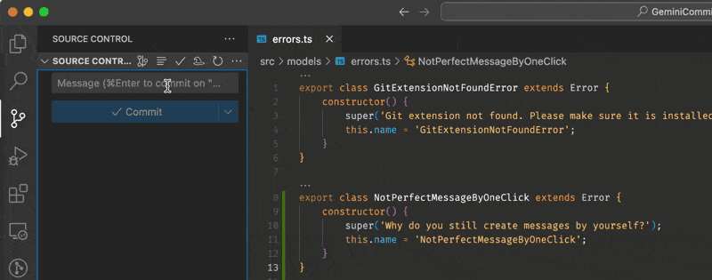

# Commit Sage (formerly GeminiCommit)

[](https://marketplace.visualstudio.com/items?itemName=VizzleTF.geminicommit) [](https://marketplace.visualstudio.com/items?itemName=VizzleTF.geminicommit) [](https://marketplace.visualstudio.com/items?itemName=VizzleTF.geminicommit) [](https://marketplace.visualstudio.com/items?itemName=VizzleTF.geminicommit) [](https://deepwiki.com/VizzleTF/CommitSage)<br>
[](https://open-vsx.org/extension/VizzleTF/geminicommit) [](https://open-vsx.org/extension/VizzleTF/geminicommit) [](https://open-vsx.org/extension/VizzleTF/geminicommit)<br>
[](https://sonarcloud.io/summary/new_code?id=VizzleTF_CommitSage) [](https://sonarcloud.io/summary/new_code?id=VizzleTF_CommitSage) [](https://sonarcloud.io/summary/new_code?id=VizzleTF_CommitSage) [](https://github.com/VizzleTF/CommitSage/actions/workflows/codeql.yml)

Commit Sage is a VS Code extension that writes Git commit messages from your changes with an AI provider of your choice.



## Install

Requires VS Code 1.93.0 or later and Git. Cloud providers need internet access; Ollama and a self-hosted Custom endpoint do not.

Install from the [VS Code Marketplace](https://marketplace.visualstudio.com/items?itemName=VizzleTF.geminicommit), from [Open VSX](https://open-vsx.org/extension/VizzleTF/geminicommit), or from the command line:

```bash
code --install-extension VizzleTF.geminicommit
```

## Quick start

1. Open the **Commit Sage** view in the Activity Bar and pick a provider. The default is `gemini`.
2. In the same view, click the button to set the API key for that provider. The view links to the page where you get the key. Or run `Commit Sage: Set <PROVIDER> API Key` from the Command Palette.

   Ollama and Custom need no key by default.
3. Stage your changes and click the Commit Sage icon in the Source Control header, press `Ctrl+G` (`Cmd+G` on macOS) in the Source Control view, or run `Commit Sage: Generate Commit Message`.

The message appears in the Source Control input box. Review it and commit.

## Features

- 11 providers: Gemini, OpenRouter, Groq, Anthropic, OpenAI, DeepSeek, xAI, Codestral, Mistral, Ollama and Custom (any OpenAI-compatible endpoint). Setup per provider: [docs/providers.md](docs/providers.md).
- Commit formats: `conventional`, `angular`, `karma`, `semantic`, `emoji`, `emojiKarma`, `google`, `atom`, `detailed`, `previous` and `custom`. See [docs/commit-formats.md](docs/commit-formats.md).
- Message languages: English, Russian, Chinese, Japanese, Korean, German, French, Spanish, Portuguese, and `custom` ([docs/custom-language.md](docs/custom-language.md)).
- Commitlint validation with auto-fix and retries. It can read the repository's commitlint config; see [Commit settings](docs/configuration.md#commit).
- Optional auto-commit and auto-push, issue references, and custom instructions.
- Per-project settings in `.commitsage/config.json`, created with `Commit Sage: Create Project Config (.commitsage)`.
- In an untrusted workspace, Commit Sage ignores trust-sensitive keys in `.commitsage/config.json` and skips auto-commit. See [Workspace trust](docs/configuration.md#workspace-trust).

## Privacy

- API keys are stored in VS Code SecretStorage, not in settings or project files.
- Your diff is sent to the selected provider. Do not use a cloud provider on a repository that contains secrets. Ollama and a self-hosted Custom endpoint keep the diff on your network.
- Telemetry is on by default. Turn it off with `commitSage.telemetry.enabled: false`; details in [docs/telemetry.md](docs/telemetry.md).

## Documentation

- [Configuration](docs/configuration.md): every setting, its default, commands and project config
- [Providers](docs/providers.md): setup for each provider
- [Commit formats](docs/commit-formats.md)
- [Custom language](docs/custom-language.md)
- [Telemetry](docs/telemetry.md)
- [Troubleshooting](docs/troubleshooting.md)
- Contributors: [Adding a provider](docs/adding-providers.md), [Adding a language](docs/adding-languages.md), [Adding a format](docs/adding-formats.md), [Testing](docs/testing.md)

## Support and license

Report bugs and ideas in [GitHub issues](https://github.com/VizzleTF/CommitSage/issues). License: MIT.

---

# Commit Sage (на русском)

Commit Sage — расширение VS Code, которое пишет commit-сообщения по вашим изменениям через выбранного AI-провайдера.

## Установка

Нужны VS Code 1.93.0 или новее и Git. Облачным провайдерам нужен интернет; Ollama и self-hosted Custom работают без него. Установите расширение из [VS Code Marketplace](https://marketplace.visualstudio.com/items?itemName=VizzleTF.geminicommit), из [Open VSX](https://open-vsx.org/extension/VizzleTF/geminicommit) или командой:

```bash
code --install-extension VizzleTF.geminicommit
```

## Быстрый старт

1. Откройте панель **Commit Sage** в Activity Bar и выберите провайдера. По умолчанию — `gemini`.
2. Там же нажмите кнопку ввода API-ключа; панель даёт ссылку на страницу получения ключа. Или выполните `Commit Sage: Set <PROVIDER> API Key` из палитры команд.

   Ollama и Custom по умолчанию работают без ключа.
3. Добавьте изменения в индекс и нажмите иконку Commit Sage в заголовке Source Control, `Ctrl+G` (`Cmd+G` на macOS) в панели Source Control или выполните `Commit Sage: Generate Commit Message`.

Сообщение появится в поле ввода Source Control. Проверьте его и закоммитьте.

## Документация

Документация на английском: [настройки](docs/configuration.md), [провайдеры](docs/providers.md), [форматы](docs/commit-formats.md), [свой язык](docs/custom-language.md), [телеметрия](docs/telemetry.md), [решение проблем](docs/troubleshooting.md).

## Поддержка

- [Telegram-канал](https://t.me/geminicommit): анонсы обновлений
- [Telegram-группа](https://t.me/gemini_commit): обсуждения и поддержка

<a href="https://www.buymeacoffee.com/vizzletf" target="_blank"></a>
